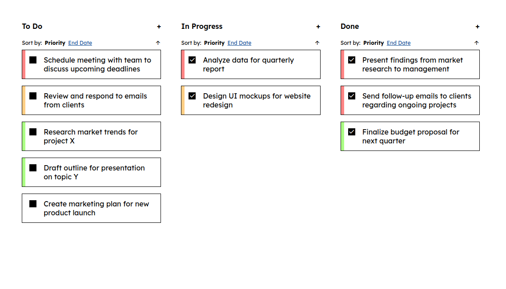
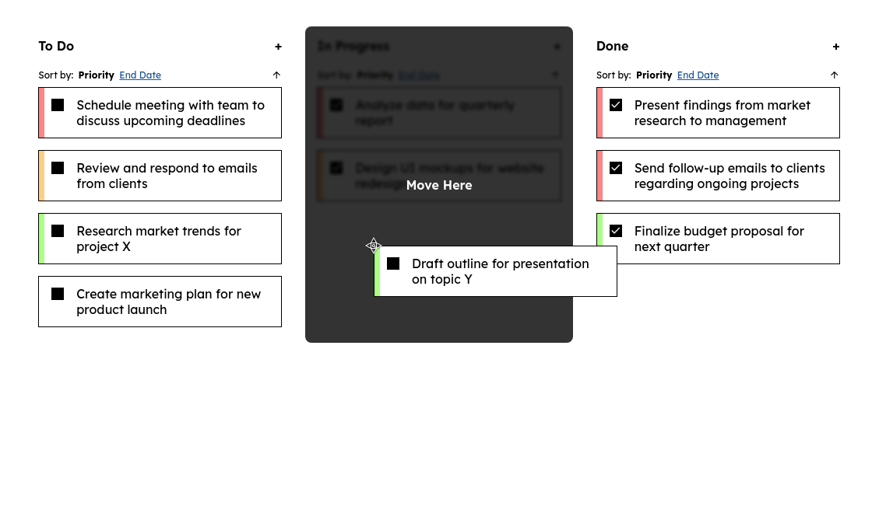
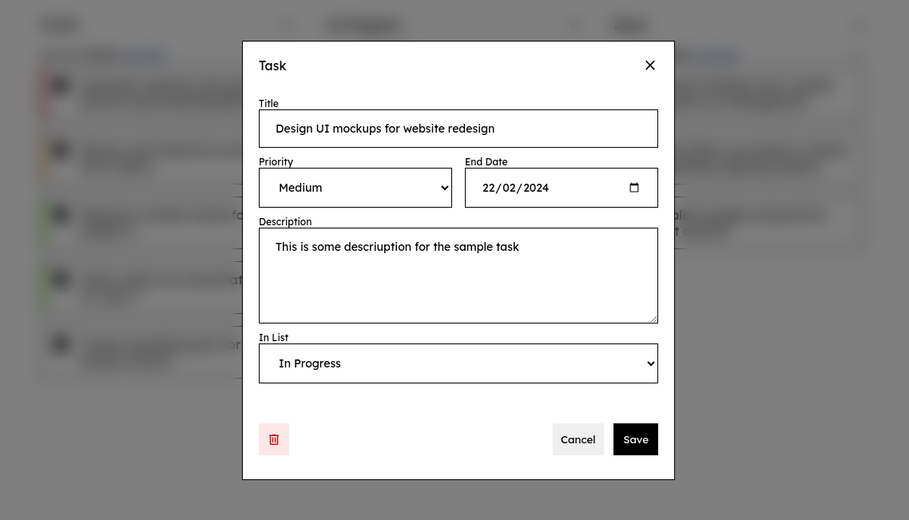

# Todo App

A simple todo app written in typescript without using any frontend library; for a learning experience.

View it live here: [Netlify](https://noor-todo-app.netlify.app)

## Setting up
    - Install dependencies
        `npm install`
    - Live view
        `npm start`
    - To build
        `npm run build`

## Screenshots

